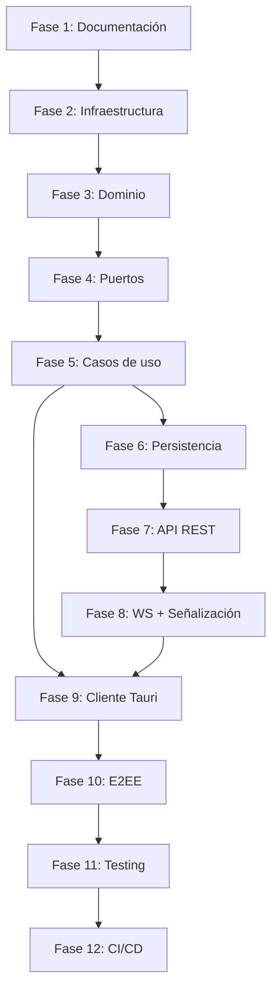

# Roadmap

## Fases del proyecto

### Fase 1: Planificación y documentación
- [x] Definir alcance y objetivos
- [x] Elegir tecnologías
- [x] Documentar arquitectura
- [x] ADRs
- [x] Modelo de dominio
- [x] Casos de uso
- [ ] Diagramas
- [ ] Plan de tareas detallado

### Fase 2: Infraestructura base (Backend)
- [ ] Inicializar proyecto Cargo
- [ ] Configurar estructura hexagonal (domain, application, ports, adapters)
- [ ] Configurar tracing/logging
- [ ] Configurar base de datos PostgreSQL (docker-compose + migraciones)
- [ ] Configurar entorno (env, config)
- [ ] Health check endpoint
- [ ] CI básico (GitHub Actions: build + lint)

### Fase 3: Dominio
- [ ] Implementar entidades (User, Session, Message, Conversation, Group)
- [ ] Implementar Value Objects
- [ ] Implementar Domain Errors
- [ ] Implementar reglas de negocio
- [ ] Tests unitarios del dominio

### Fase 4: Puertos (Interfaces)
- [ ] UserRepository trait
- [ ] SessionRepository trait
- [ ] ConversationRepository trait
- [ ] GroupRepository trait
- [ ] AuthPort trait (JWT)
- [ ] PresencePort trait
- [ ] SignalingPort trait

### Fase 5: Casos de uso (Aplicación)
- [ ] UC-01: Register
- [ ] UC-02: Login
- [ ] UC-03: Validate JWT
- [ ] UC-04: Refresh token
- [ ] UC-05: Logout
- [ ] UC-23: Search users
- [ ] UC-24: List online users
- [ ] UC-25: Get user profile
- [ ] Tests unitarios de casos de uso (con mocks)

### Fase 6: Adaptadores de persistencia
- [ ] PostgresUserRepository
- [ ] PostgresSessionRepository
- [ ] PostgresConversationRepository
- [ ] PostgresGroupRepository
- [ ] Migraciones SQL
- [ ] Tests de integración con BD

### Fase 7: API REST
- [ ] POST /api/v1/auth/register
- [ ] POST /api/v1/auth/login
- [ ] POST /api/v1/auth/refresh
- [ ] POST /api/v1/auth/logout
- [ ] GET /api/v1/users/search
- [ ] GET /api/v1/users/online
- [ ] GET /api/v1/users/:id
- [ ] GET /api/v1/users/:id/public-key
- [ ] POST /api/v1/groups
- [ ] GET /api/v1/groups/:id
- [ ] POST /api/v1/groups/:id/members
- [ ] DELETE /api/v1/groups/:id/members/:user_id
- [ ] Error handling middleware
- [ ] Auth middleware (JWT validation)

### Fase 8: WebSocket + Señalización WebRTC
- [ ] WS /api/v1/ws (WebSocket handler)
- [ ] Autenticación vía JWT en conexión WS
- [ ] Heartbeat (Ping/Pong)
- [ ] Manejo de presencia (online/offline broadcast)
- [ ] Señalización: offer/answer/ICE candidates
- [ ] TURN credentials endpoint
- [ ] Reconexión

### Fase 9: Cliente Tauri (Frontend)
- [ ] Inicializar proyecto Tauri
- [ ] Pantalla de login/registro
- [ ] Conexión WebSocket con servidor
- [ ] Lista de contactos (online/offline)
- [ ] Señalización WebRTC (establecer Data Channel)
- [ ] Interfaz de chat 1:1
- [ ] Vista de grupos
- [ ] Indicadores: typing, delivery, read
- [ ] Historial local (almacenamiento)

### Fase 10: E2EE (Cifrado extremo a extremo)
- [ ] Implementar X25519 ECDH
- [ ] Implementar XChaCha20-Poly1305
- [ ] Implementar Ed25519 firmas
- [ ] Implementar Doble Rachet
- [ ] Intercambio de claves (X3DH)
- [ ] Clave de grupo (Sender Keys)
- [ ] Keychain integration
- [ ] Tests de vectores de prueba conocidos

### Fase 11: Testing
- [ ] Tests unitarios (dominio + casos de uso)
- [ ] Tests de integración (API + BD)
- [ ] Tests de WebSocket (señalización)
- [ ] Tests E2E con múltiples clientes
- [ ] Pruebas de mesh (N clientes simultáneos)
- [ ] Pruebas de reconexión
- [ ] Benchmarks

### Fase 12: CI/CD y despliegue
- [ ] GitHub Actions: build + test + lint
- [ ] GitHub Actions: build Tauri
- [ ] Dockerfile backend
- [ ] docker-compose (backend + db + turn)
- [ ] Configuración de TURN server (Coturn)
- [ ] Scripts de despliegue
- [ ] Documentación de instalación

---

## Dependencias entre fases

---

## Estimación (orientativa)

| Fase | Duración estimada |
|------|-------------------|
| F1 | Completada |
| F2 | 2-3 días |
| F3 | 3-4 días |
| F4 | 2 días |
| F5 | 3-4 días |
| F6 | 2-3 días |
| F7 | 3-4 días |
| F8 | 4-5 días |
| F9 | 2-3 semanas |
| F10 | 1 semana |
| F11 | 1 semana |
| F12 | 3-4 días |
| **Total** | **~8-10 semanas** |
